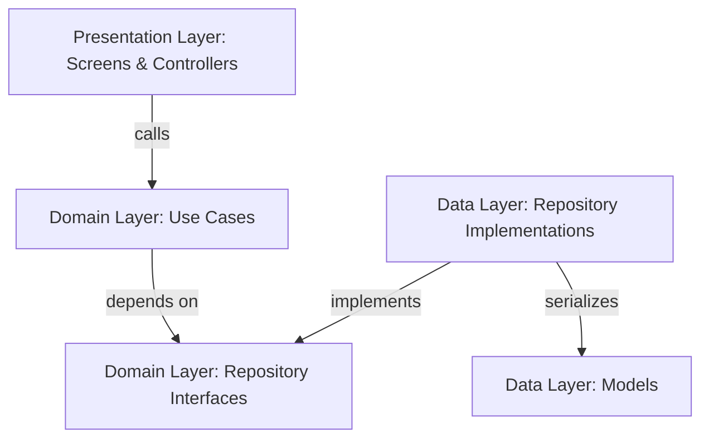

# Princess App

A high-fidelity, production-ready Flutter authentication and onboarding starter template built using Feature-first Clean Architecture, Riverpod, GoRouter, and a custom dark theme design system.

---

## Architecture

This project follows a **Feature-first Clean Architecture** approach, ensuring complete separation of concerns and decoupling logic from user layouts.

The codebase is split into:
*   **`core`**: Contains global constants (colors, routes, spacing), base theme configurations, custom exceptions/failures, functional result models, and reusable components.
*   **`features`**: Contains decoupled functional components. Each feature is split into:
    *   `domain`: Entities (business data models), repository contracts (interfaces defining capability), and use cases (single business transactions).
    *   `data`: Serialization models and repository implementations.
    *   `presentation`: Controllers (Riverpod states), screen layouts, and child widgets.



### Mock/Fake Repository Isolation
The authentication flow utilizes `FakeAuthRepository` mapped under the `AuthRepository` interface in the domain layer:
1.  The presentation screens do not know where or how authentication is executed. They only dispatch commands through usecases.
2.  Use cases trigger the abstract `AuthRepository` functions.
3.  The `FakeAuthRepository` simulates authentications using synthetic delays and checks.
4.  This isolates the layout from cloud providers, showing great software engineering and letting you plug in real Firebase, Supabase, or REST repositories later in the data layer without editing any presentation file.

---

## State Management

The app uses **Riverpod** for robust, testable state management.

1.  **Repository Providers**: Expose the repository implementation bound to the domain interface.
2.  **UseCase Providers**: Inject the repository dependency into each separate usecase class.
3.  **Controllers**: Implemented via `StateNotifier` to govern UI views:
    *   `AuthController` manages loading statuses, validation error logs, and credential flows.
    *   `OnboardingController` controls onboarding paginated navigation.

---

## Styling System

Built from scratch with a custom, premium visual dark mode theme:
*   **Backgrounds**: Rich obsidian colors combined with glowing radial background gradients.
*   **Inputs**: Custom text boxes with glowing neon indigo outlines when active.
*   **Components**: Gradient primary buttons, SMS code verification panels (using `pinput`), and custom social buttons.
*   **Assets**: Branding logos and onboarding page visuals are loaded inline as SVGs (via `flutter_svg`) to guarantee they display correctly out of the box without any missing local asset file warnings.

---

## Project Structure

```
lib/
  main.dart
  app.dart

  core/
    constants/
      app_colors.dart         # Premium obsidian, indigo & gold theme
      app_assets.dart         # Embedded vector branding SVGs
      app_spacing.dart        # Margins, padding, and border radius metrics
      app_routes.dart         # Path routing keys

    errors/
      app_exception.dart      # Custom exceptions
      failure.dart            # Mapped user-facing failures

    result/
      result.dart             # Custom Success/Failure union type

    theme/
      app_theme.dart          # Outfit/Inter typography & Material3 dark style

    router/
      app_router.dart         # GoRouter setup with auth routing

    widgets/                  # High fidelity custom layouts
      app_button.dart
      app_text_field.dart
      app_password_field.dart
      social_button.dart
      auth_divider.dart
      auth_scaffold.dart
      app_back_button.dart
      loading_overlay.dart

  features/
    auth/
      domain/
        entities/
          app_user.dart
        repositories/
          auth_repository.dart
        usecases/
          sign_in_usecase.dart
          sign_up_usecase.dart
          complete_profile_usecase.dart
          request_password_reset_usecase.dart
          verify_otp_usecase.dart
          create_new_password_usecase.dart

      data/
        models/
          user_model.dart
        repositories/
          fake_auth_repository.dart

      presentation/
        controllers/
          auth_controller.dart
          auth_form_state.dart
        screens/
          welcome_screen.dart
          sign_in_screen.dart
          sign_up_screen.dart
          fill_profile_screen.dart
          forgot_password_screen.dart
          otp_screen.dart
          create_password_screen.dart
          success_screen.dart
          dashboard_screen.dart
        widgets/
          auth_header.dart
          profile_avatar.dart

    onboarding/
      domain/
        entities/
          onboarding_page.dart
      presentation/
        controllers/
          onboarding_controller.dart
        screens/
          onboarding_screen.dart
        widgets/
          onboarding_page_view.dart
```

---

## Getting Started

### Prerequisites
1.  Ensure you have the Flutter SDK installed on your system.
2.  Enable Windows Developer Mode if compiling for Windows (run `start ms-settings:developers` and toggle on).

### Setup and Running
1.  Navigate into the project directory:
    ```bash
    cd princess_app
    ```
2.  Get packages:
    ```bash
    flutter pub get
    ```
3.  Analyze files for correctness:
    ```bash
    flutter analyze
    ```
4.  Run the application on a connected device/emulator:
    ```bash
    flutter run
    ```

---

## How to replace Fake Auth with Real APIs

When you are ready to transition to services like Firebase or Supabase:

1.  **Add packages**:
    ```bash
    flutter pub add firebase_auth
    ```
2.  **Create a new implementation**:
    Write a repository class inside `lib/features/auth/data/repositories/` implementing the domain `AuthRepository`:
    ```dart
    import 'package:firebase_auth/firebase_auth.dart' as fb;
    import '../../domain/repositories/auth_repository.dart';

    class FirebaseAuthRepository implements AuthRepository {
      final fb.FirebaseAuth _firebaseAuth = fb.FirebaseAuth.instance;

      @override
      Future<AppUser> signIn({required String email, required String password}) async {
        final credential = await _firebaseAuth.signInWithEmailAndPassword(
          email: email,
          password: password,
        );
        return AppUser(id: credential.user!.uid, email: email);
      }
      // ... implement other methods
    }
    ```
3.  **Update the provider binding**:
    In `lib/features/auth/presentation/controllers/auth_controller.dart`, change `authRepositoryProvider` to instantiate your new class:
    ```dart
    final authRepositoryProvider = Provider<AuthRepository>((ref) {
      return FirebaseAuthRepository();
    });
    ```
4.  **Done!** The UI screens, use cases, and controllers will continue to work perfectly without a single change since they only depend on the `AuthRepository` interface!
